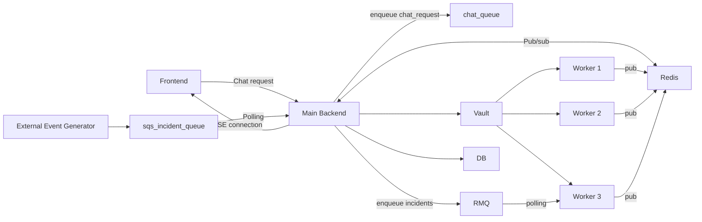

# Infra AI Frontend

Next.js 15 frontend for incident operations, CMDB, credentials, chat-driven remediation, RCA, and admin workflows.

## What this project provides

- Clerk-authenticated UI for Infra AI backend workflows
- Incident dashboard with live progress and SSE-based updates
- Incident detail, results, and RCA views
- CMDB and service operations UI
- Knowledge base and observability screens
- Integrations and credentials management pages
- Admin pages for users, alerts, approvals, and escalation rules

## Tech stack

- Next.js 15 (App Router)
- React 19
- Clerk authentication
- Tailwind CSS + Radix UI
- Axios and fetch-based API calls

## Architecture overview

The frontend acts as the operator console for the incident platform. It authenticates users with Clerk, sends requests to the backend, and renders live execution updates from SSE-backed workflows.



### Frontend responsibilities

- `Frontend` provides authenticated dashboards, chat, knowledge, CMDB, and admin workflows.
- `app/api/stream` and `app/api/execute` proxy backend SSE traffic with Clerk-issued bearer tokens.
- `Main Backend` handles orchestration, queue dispatch, persistence, and worker coordination.
- `Redis`, `RMQ`, and SQS-backed queues support live job fan-out and asynchronous execution.

## Repository layout

- `app/`: Next.js App Router pages for dashboard, incident details, chat, CMDB, credentials, integrations, knowledge, observability, problems, RCA, services, and admin workflows
- `app/api/`: server-side proxy routes and shared backend URL helper
  - `app/api/_lib/backend.js`: backend URL resolution helper
  - `app/api/stream/route.js`: SSE stream proxy
  - `app/api/execute/route.js`: incident execution stream proxy
- `components/`: shared shell/theme components
- `components/ui/`: reusable Radix/Tailwind UI primitives
- `lib/`: helper utilities
- `public/`: static assets
- `tests/`: Vitest suites for API routes, components, and library helpers
- `middleware.js`: Clerk middleware

## Prerequisites

- Node.js 20+ recommended
- Running backend API (default expected at `http://127.0.0.1:8000` or `http://localhost:8000`)
- Clerk project with an `auth_token` template configured for backend JWT verification

## Environment variables

Create `.env.local` with at least:

```bash
NEXT_PUBLIC_CLERK_PUBLISHABLE_KEY=...
CLERK_SECRET_KEY=...
NEXT_PUBLIC_API_URL=http://127.0.0.1:8000
```

Optional backend routing vars used by API proxy fallback logic:

```bash
API_INTERNAL_URL=http://127.0.0.1:8000
BACKEND_URL=http://127.0.0.1:8000
```

Notes:

- `next.config.mjs` rewrites `/api/:path*` to `http://localhost:8000/:path*`.
- Some pages still call backend URLs directly using `localhost` or `127.0.0.1`, so backend must be reachable there unless you refactor those calls.

## Install and run

```bash
cd infra-ai-frontend
npm install
npm run dev
```

App URL:

- `http://localhost:3000`

## Available scripts

- `npm run dev`: start dev server
- `npm run dev:clean`: clear `.next` then start dev server
- `npm run build`: production build
- `npm run build:clean`: clean and build
- `npm run start`: run production build
- `npm run lint`: run lint checks
- `npm test`: run unit tests
- `npm run format:check`: validate formatting for the shared proxy/helpers and tests

## Important routes

- `/dashboard`: incident list, creation, and live status
- `/Details/[...slug]`: incident details and remediation outputs
- `/chat`: assistant workflow
- `/cmdb`: CMDB management
- `/knowledge`: KB upload/search
- `/creds`: credentials and integrations setup
- `/rca`, `/rca/[id]`: RCA overview/details
- `/admin/*`: admin workflows (users, alerts, approvals, escalation)

## API proxy routes in this repo

- `GET /api/stream?incident=<inc_number>`
  - Proxies backend SSE stream endpoint with Clerk bearer token
- `POST /api/execute`
  - Proxies backend `/incident/stream` with Clerk bearer token

## Build for production

```bash
npm run build
npm run start
```

Container image:

```bash
docker build -t infra-ai-frontend .
docker run -p 3000:3000 infra-ai-frontend
```

## Testing and delivery

Local quality checks:

```bash
npm run format:check
npm run lint
npm test
npm run build
```

GitHub Actions pipeline:

- `quality` job installs dependencies, checks formatting, lints the app, runs Vitest, and verifies the production build.
- `docker` job runs on pushes to `main` after the quality gate passes and publishes `ghcr.io/<owner>/infra-ai-frontend`.

## Troubleshooting

- If requests fail with `401`:
  - verify Clerk keys
  - verify JWT template name is `auth_token`
- If stream/proxy endpoints fail:
  - verify backend is running on configured URL(s)
  - verify backend CORS/auth settings
- If UI is stale:
  - run `npm run dev:clean`
